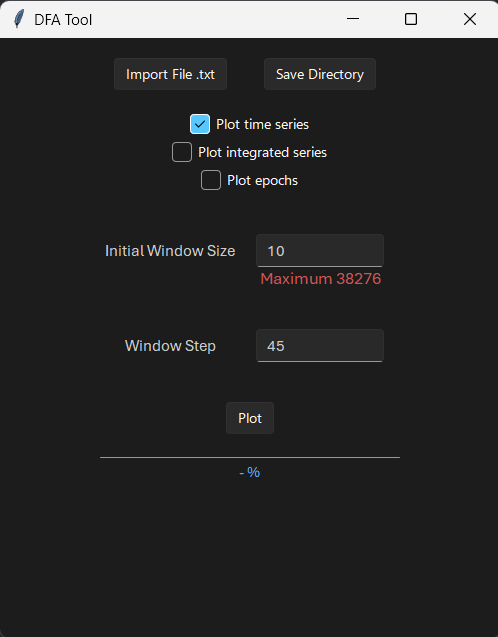

# Detrended Fluctuation Analysis (DFA) Tool in Python

This repository contains a Python implementation of the Detrended Fluctuation Analysis (DFA) method which through a GUI allows the user to analyze a _.txt_ file containing a time series data. 

This implementation uses **pytorch, numpy, scipy, matplotlib, and tkinter libraries**.

Said _.txt_ file should contain two columns: the time values **(x-axis)** and the data values **(y-axis)**. Also, it may contain a header with the name of the columns.

Example of a valid _.txt_ file:
```
Time    Data
1591.0  0.0
1624.1  1.0
1912.4  2.0
2190.1  3.0
2723.6  4.0
3356.7  5.0
3889.8  6.0
...     ...
```

## This implementation is aimed to the Delfinitli project

This implementation is used on the **Delfinitli** project which restricts the code in the following way:
- The data file contains 14 columns from which the first one is the time values and the third one is the data values. (**main.py line 94**, attribute `usecols(0, 2)`)
- The time series values are sampled at 512 Hz. (**DFA.py line 123**, conversion to seconds)

If you want to use this implementation for a different project, you should modify the code accordingly.

## User Interface

The GUI requires the user to:
- **Import a .txt file** containing the time series data.
- **Select the save directory** of the results (plots and data).

Afterward, the user can:
- Select plots to save: original time series, integrated time series and epochs.
- The initial window size for the sweeping process. Also displays the maximum window size given by N/4 where N is the number of data values.
- The number of window steps to perform the sweeping process i.e. the desired amount of windows to analyze.

The numeric fields default to an initial window size of 10 and 45 window steps.



## Usage

To run the GUI, execute the following command in the terminal:
```
python main.py
```

## DFA implementation

Lastly, the DFA method code is contained in the `DFA.py` file. This file contains two methods: the DFA method for a given window size and the DFA Plot method which sweeps through the window sizes and plots the result.

The following descriptions are also found as docstrings in the code.

### DFA_Method
```python
def DFA_Method(x: torch.Tensor, y: torch.Tensor, window_size: int | torch.Tensor, plot_epochs=False, plot_time_series=False, plot_sum_series=False, save_path=None)
```
Returns F (fluctuation) of the integrated time series y, computed using the
Detrended Fluctuation Analysis (DFA) method.

Parameters:
- **x**:                   X axis of the time series (time)
- **y**:                   Y axis of the time series (amplitude)
- **window_size**:         Size of the windows to subdivide the integrated time series
- **plot_epochs**:         If True, the method will plot each window
- **plot_time_series**:    If True, the method will plot the time series
- **plot_sum_series**:     If True, the method will plot the integrated time series
- **save_path**:           Path to save the plot. If None, instead the plot will be shown

### DFA Plot Method
```python
def DFA_F_Plot(x: torch.Tensor, y: torch.Tensor, initial_window_size=10, window_size_step=45, plot_epochs=False, plot_time_series=False, plot_sum_series=False, save_path=None, hook=None, file_name=None)
```
Plots the window size sweep of the DFA method, and returns the slope of the linear regression of the log-log plot.

The plot is given by the log10(F) values for each window size log10(N).

Parameters:
- **x**:                           X axis of the time series (time)
- **y**:                           Y axis of the time series (amplitude)
- **initial_window_size**:     Initial window size. Default is 10, and the limit is N/4 (N = number of samples)
- **window_size_step**:        Number of steps to reach the maximum window size i.e. how many DFA plot points. Default is 45
- **plot_epochs**:                 If True, the method will plot each window
- **plot_time_series**:            If True, the method will plot the time series
- **plot_sum_series**:             If True, the method will plot the integrated time series
- **save_path**:                   Path to save the plot. If None, instead the plot will be shown
- **file_name**:                   File name to save the plot i.e. "DFA_Plot.png"
- **hook**:                        Function to update/monitor progress bar

